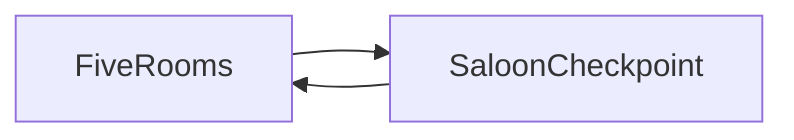

# Six Chambers — game context for prompts

Use this file when writing prompts for AI or collaborators. It summarizes **identity**, **vibe**, **what is implemented**, **content inventory**, and **conventions** so new work stays consistent with the project.

---

## One-line identity

**Six Chambers** (*A Cowboy Roguelike*) is a **2D cowboy roguelike platformer** built with **LOVE2D 11.5** and **Lua**: revolver combat, procedural-ish room runs, XP/perks/gold/gear, and a **saloon checkpoint** with blackjack and a bartender shop. Death resets the run from the beginning.

---

## Vibe and creative direction

- **Setting**: Western frontier — saloon, gold, whiskey, bandoliers, sheriff hats, dusty danger.
- **Gameplay feel**: Arcade **platform combat** with **mouse-aimed shooting** (left click fires toward the cursor in world space), **six-round cylinder**, **reload** (keyboard `R` or right mouse). **Screen shake** on shots; camera **2× zoom** following the player across wide arenas.
- **Meta layer**: Roguelike **run persistence within a life** — XP, level-ups, perk drafts, gold, shop purchases, blackjack wagers; **permadeath** ends the run.
- **Visual / audio direction** (current build):
  - **Nearest-neighbor** filtering (`main.lua`) — pixel-crisp scaling.
  - **Menu**: Dark brown void, **gold title**, warm horizontal accent lines, flickering “Press ENTER” ([`src/states/menu.lua`](src/states/menu.lua)).
  - **Run**: Parallax **forest** background (`assets/backgrounds/forest.png`) ([`src/states/game.lua`](src/states/game.lua)).
  - **Saloon**: Dark wood tones, bar counter strip, same gold accent palette ([`src/states/saloon.lua`](src/states/saloon.lua)).
  - Assets folder may use **placeholder** art (see README); assume **1280×720** logical resolution unless designing for a different base.

**Copy drift to know about**: the main menu hint says *“Auto-Aim & Fire”* but combat is **aim-with-mouse, click to fire** (documented in [`README.md`](README.md)). Prefer README + this file for controls when prompting features.

---

## Run loop (authoritative)

Difficulty rises as rooms are cleared (`RoomManager`), not only at the saloon.

1. **Five rooms** per checkpoint (`ROOMS_PER_CHECKPOINT` in [`src/data/rooms.lua`](src/data/rooms.lua)).
2. Each checkpoint builds a **sequence of 5 rooms** by **random choice with replacement** from a pool of **four** hand-authored layouts ([`src/systems/room_manager.lua`](src/systems/room_manager.lua)): `canyon_run`, `cliffside`, `underground`, `mesa_heights`.
3. In a room: **defeat all enemies** → exit **door unlocks** → player reaches door → **next room**. Falling past a **kill plane** (large vertical bounds) ends the run.
4. After the fifth room, the game **pushes** the **Saloon** state ([`src/states/saloon.lua`](src/states/saloon.lua)):
   - **[1] Blackjack**: requires **≥ 10 gold**; wager is **`min(player gold, 20)`** deducted at start. Hit/stand; on result, gold and sometimes a **perk draft** (see saloon + blackjack logic).
   - **[2] Bartender (shop)**: healing, random **gear** roll, **cylinder +2** upgrade — prices scale with difficulty ([`src/systems/shop.lua`](src/systems/shop.lua)).
   - **[3] / Enter**: **continue** — new 5-room sequence, **`roomManager:startNewCycle()`**, then back to gameplay.
5. **Difficulty**: `RoomManager.difficulty` increases with **`totalRoomsCleared`** (`1 + totalRoomsCleared * 0.3` in [`src/systems/room_manager.lua`](src/systems/room_manager.lua)), affecting enemy scaling and shop generation.
6. **Level-up**: Gaining a level opens the **level-up** state — pick **1 of 3** perks ([`src/states/levelup.lua`](src/states/levelup.lua), [`src/systems/progression.lua`](src/systems/progression.lua)).
7. **Death**: Run ends; player restarts from **room 1** of a fresh run (see [`README.md`](README.md) / game over flow).

---

## Implemented systems (checklist)

| Area | Notes |
|------|--------|
| **Player** | Movement, gravity, coyote time, jump buffer; stats, gear, perks, XP/gold; shooting/reload/Dead Eye timer ([`src/entities/player.lua`](src/entities/player.lua)) |
| **Combat / world** | `bump` collision, bullets, enemy AI driven by [`src/data/enemies.lua`](src/data/enemies.lua) ([`src/systems/combat.lua`](src/systems/combat.lua)) |
| **Rooms** | Lua-defined platforms/spawns/exit; walls and door; no Tiled map in the run loop |
| **Progression** | XP curve, level-up perk rolls, perk application |
| **Economy** | Gold drops, shop, blackjack |
| **Gear** | Three slots: hat, vest, boots ([`src/data/gear.lua`](src/data/gear.lua), [`src/systems/inventory.lua`](src/systems/inventory.lua)) |
| **UI** | HUD (HP, ammo cylinder, XP, gold), perk cards ([`src/ui/hud.lua`](src/ui/hud.lua), [`src/ui/perk_card.lua`](src/ui/perk_card.lua)) |
| **Debug** | **F1** toggles global `DEBUG`; game state can append **`DEBUG_LOG`** lines ([`src/states/game.lua`](src/states/game.lua)) |
| **Rendering** | Fixed **1280×720** game canvas; window is **letterboxed to a 1920×1080 (16:9) frame** (ultrawide gets side bars; game never stretches wider than 1080p-class 16:9). Canvas and UI fonts use **linear** filtering for smoother scaling; UI fonts via [`src/ui/font.lua`](src/ui/font.lua). `windowToGame` for mouse ([`main.lua`](main.lua)) |

---

## Content inventory (avoid duplicate names / concepts)

### Enemies (`src/data/enemies.lua`)

| ID | Role | Notes |
|----|------|--------|
| `bandit` | Melee | Rust-colored rect; chases |
| `gunslinger` | Ranged | Purple-ish; shoots |
| `buzzard` | Flying | Brown; swoop-style threat |

Stats scale with **difficulty** in code.

### Perks — display names (`src/data/perks.lua`)

Twelve perks total, **weighted** draft with **luck** biasing uncommon/rare.

**Common**

- Steady Hand — +15% damage  
- Quick Draw Boots — +12% move speed  
- Tough Hide — +20% max HP  
- Iron Gut — +1 armor  

**Uncommon**

- Sleight of Hand — 30% faster reload  
- Extended Cylinder — +1 round in cylinder  
- Blood Thirst — heal 5 HP on kill  
- Lucky Charm — +15% luck  

**Rare**

- Scattershot — 3 bullets in a spread  
- Explosive Rounds — bullets explode (AOE)  
- Ricochet — bullets bounce once off walls  
- Dead Eye — slow-mo after reload  

### Gear — slots and items (`src/data/gear.lua`)

- **Slots**: hat, vest, boots (three tiers each).  
- **Hats**: Cowboy Hat, Ten Gallon Hat, Sheriff's Hat  
- **Vests**: Leather Vest, Reinforced Vest, Bandolier  
- **Boots**: Riding Boots, Spurred Boots, Snakeskin Boots  

Shop offers **one random gear** per visit (tier capped by difficulty), plus **Whiskey (Heal 50%)** and **Extended Cylinder (+2)**.

---

## Stack and repo layout

- **Engine**: LOVE2D **11.5** ([`conf.lua`](conf.lua): identity `sixchambers`, window title *Six Chambers*).
- **Libs**: **bump** (collision), **hump** (gamestate, camera, timers, vectors), **STI** and **anim8** included — README notes STI/anim8 as **available**; **rooms are not loaded from Tiled at runtime** (hand-authored Lua).
- **Structure**: See **Project Structure** in [`README.md`](README.md) — `src/states/`, `src/entities/`, `src/systems/`, `src/data/`, `src/ui/`, `assets/`.

---

## Prompting guidelines (for AI / design briefs)

1. **Preserve architecture**: New gameplay data usually belongs in **`src/data/*.lua`**; systems in **`src/systems/`**; screens in **`src/states/`**. Use **hump.gamestate** patterns already in the repo.
2. **Naming**: Keep **Western / saloon** tone consistent with existing perks and gear (concrete cowboy words, not generic fantasy).
3. **Art / UI**: Assume **pixel scale**, **1280×720** logical frame, **nearest** filter unless changing `main.lua`.
4. **Do not assume**: Tiled maps in the main loop, auto-aim (use **mouse aim**), or more than **four** room layouts unless you add them to [`src/data/rooms.lua`](src/data/rooms.lua).
5. **Balance hooks**: Difficulty uses **`RoomManager.difficulty`** and **`totalRoomsCleared`**; enemies use [`EnemyData.getScaled`](src/data/enemies.lua); shop uses difficulty for prices and max gear tier.

---

## Related docs

- Player-facing overview and controls: [`README.md`](README.md)
