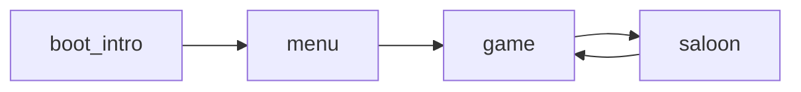

# Cutscenes i Six Chambers – hur det funkar idag och var man bygger vidare

## Vad som inte finns

Det finns ingen modul, state eller datatabell som heter cutscene, cinematic eller liknande. Berättande sekvenser utöver **boot / titel** och **3–2–1-räknare** är inte implementerade.

## Befintliga byggstenar (nära “cutscene”)

### 1. Boot-intro (fasbaserad sekvens)

- **State:** [`src/states/boot_intro.lua`](../src/states/boot_intro.lua)
- **Data:** [`src/data/boot_intro.lua`](../src/data/boot_intro.lua)
- **Flöde:** [`main.lua`](../main.lua) startar med `Gamestate.switch(boot_intro)` → efter studio / title / fade → `Gamestate.switch(menu, { fromIntro = true })`.

Mönster som är relevant för cutscenes:

- **Faser** (`PHASE.studio`, `title`, `fade_out`) med `phaseTime` och `setPhase()`.
- **Tidsstyrda övergångar** i `update(dt)` (jämför `phaseTime` mot `C.studioDuration`, `titleDuration`, etc.).
- **Skip:** valfritt steg-för-steg eller hoppa till meny (`advanceSkip`).
- **Rendering:** egen `draw()` med FX ([`src/ui/boot_fx.lua`](../src/ui/boot_fx.lua)), bakgrundsbild, text.
- **Musik:** [`src/systems/menu_bgm.lua`](../src/systems/menu_bgm.lua) startas i `enter` och fortsätter in i menyn.

Detta är den **tydligaste mallen** för en “riktig” cutscene: eget spelläge, data i separat Lua-tabell, byte till nästa state med `opts`.

### 2. Intro countdown i spel (overlay, fryst gameplay)

- **Plats:** [`src/states/game.lua`](../src/states/game.lua) – tabellen `introCD`, flaggor `introCountdown` i `Gamestate.switch(game, { … })`.

Beteende:

- Rummet och fiender är laddade; **input och mycket spel-logik returnerar tidigt** när `introCD.active` (t.ex. rörelse, skjutning – sök i `game.lua` efter `introCD.active`).
- **Overlay** ritas ovanpå världen (mörk toning + stor siffra 3→2→1).
- Används från menyn ([`src/states/menu.lua`](../src/states/menu.lua) `beginGameWithIntroCountdown`), saloon ([`src/states/saloon.lua`](../src/states/saloon.lua)), game over ([`src/states/gameover.lua`](../src/states/gameover.lua)).

Det är **inte** dialog eller story, men visar hur man **pausar spelet** och visar något ovanpå samma kamera/värld – användbart om man vill ha **in-game cutscene utan nytt Gamestate** (t.ex. kort text + bild ovanpå nivån).

### 3. Spellägesmaskin (hump Gamestate)

- **Registrering:** [`main.lua`](../main.lua) – `Gamestate.registerEvents`, byten mellan `boot_intro`, `menu`, `game`, `saloon`, `levelup`, `gameover`, etc.

Varje större skärm är ett **eget state** med `enter` / `leave` / `update` / `draw`. En dedikerad **cutscene-state** skulle passa naturligt in: `Gamestate.switch(cutscene, { next = game, scriptId = "opening", … })`.

### 4. Musik / pacing

- [`src/systems/music_director.lua`](../src/systems/music_director.lua) läser bl.a. `introCountdownActive` från en snapshot – nya lägen kan behöva liknande **hooks** om musik ska duckas eller pausas under cutscene.

---

## Två rimliga riktningar (design, ej implementation)

| Ansats | Beskrivning | Passar när |
|--------|-------------|------------|
| **Nytt state** (som `boot_intro`) | Egen `cutscene.lua` + `data/cutscenes/foo.lua` med faser, bilder, text, timers; avslut med `Gamestate.switch(...)` | Fullskärm, mellan nivåer, före/efter boss, intro till kapitel |
| **Overlay i `game`** (som `introCD`) | Utöka mönstret med en “modal” berättelse-flagga som stoppar input och ritar dialog/ruta | Korta repliker i samma rum, miljöhändelser utan att lämna världen |

---

## Kort flödesdiagram (befintlig kedja)

En framtida cutscene skulle kunna **sättas in som en ny nod** mellan valfria noder (t.ex. `menu --> cutscene --> game`) eller **inuti** `game` som ett overlay-steg.

---

## Rekommenderad dokumentationsrad (om du skriver egen doc)

- Peka på **boot_intro + boot_intro data** som referensimplementation för tids-/fasstyrd sekvens.
- Peka på **introCD i game** som referens för “pausa världen, rita ovanpå”.
- Notera att **dialogsystem** inte finns i kodbasen i skrivande stund; text skulle vara ny data + UI.
