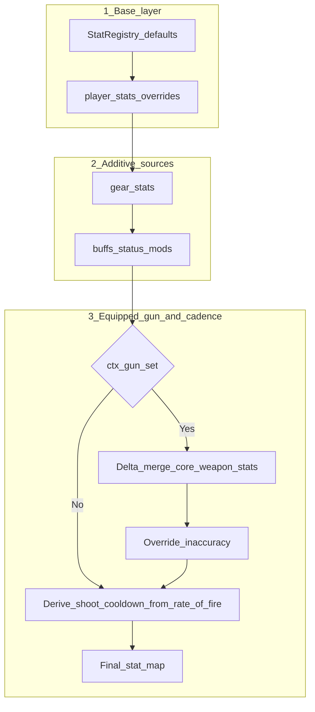

# Player and weapon stat resolution

How **effective combat stats** are built when the player has gear, buffs, and an equipped gun. See also [`weapon_architecture.md`](weapon_architecture.md) for the broader weapon model.

## Mental model vs implementation

- **Common expectation:** separate “character sheet” and “weapon sheet” that stack additively (e.g. character damage + weapon damage).
- **Actual implementation:** a **single** stat vector (`player.stats`) seeded with defaults (including revolver-aligned gun fields), then **additive** contributions from gear and buffs, then a **weapon merge** that either **rebases** selected stats against the starter revolver baseline (preserving build delta) or **overrides** a few fields directly from the gun definition.

## Resolution pipeline

Implemented in `StatRuntime.compute_actor_stats` (`src/systems/stat_runtime.lua`).



### Code entry points

| Concern | Location |
|--------|-----------|
| Merge logic | `src/systems/stat_runtime.lua` — `compute_actor_stats`, `build_player_context` |
| Revolver baseline (must stay in sync with `Player.new`) | `src/entities/player.lua` — `PLAYER_BASE_GUN_STATS` |
| Gun definitions | `src/data/guns.lua` — `baseStats` per weapon |
| Resolved stats when firing | `src/systems/weapon_runtime.lua` — `getResolvedStatsForGun` |

## Gun merge: delta vs override

### Delta merge (revolver-anchored)

For these normalized stat ids:

```text
effective = gun_value + (player_value_after_gear_buffs − revolver_baseline)
```

`revolver_baseline` is `player.baseGunStats` / `PLAYER_BASE_GUN_STATS` (same authoring keys as the starter weapon).

**Stats in this group:**

- `projectile_damage` (`bulletDamage`)
- `magazine_size` (`cylinderSize`)
- `reload_time` (`reloadSpeed`)
- `projectile_speed` (`bulletSpeed`)
- `projectile_count` (`bulletCount`)
- `spread_angle` (`spreadAngle`)
- `crit_chance` (`critChance`)
- `crit_damage` (`critDamage`)
- `rate_of_fire` (`rateOfFire`) — shots per second; registry default **1** (= 1 shot per second)

### Derived (not gun-authored directly)

After the gun merge (and all additive sources), **`shoot_cooldown` is always** `1 / rate_of_fire` (clamped). Legacy alias `shootCooldown` in exported stats matches that value. Perks or gear that change `rateOfFire` / `rate_of_fire` on `player.stats` therefore shift cadence; flat changes to `shootCooldown` alone are overwritten by this step unless they run in a system that edits stats after resolution (prefer authoring fire rate on `rateOfFire`).

### Override (no delta)

If present on the gun’s `baseStats`, **`inaccuracy`** replaces the value computed so far (build changes on `player.stats` for that key do **not** apply through a delta step).

## Worked example (bullet damage)

| Step | `bulletDamage` |
|------|----------------|
| Revolver baseline (reference) | 10 |
| Perk +3 on `player.stats.bulletDamage` | 13 |
| Equip gun with `baseStats.bulletDamage = 5` | **5 + (13 − 10) = 8** |

## Authoring checklist

1. Keep **`PLAYER_BASE_GUN_STATS` and gun-related fields in `Player.new().stats`** aligned with the starter revolver.
2. Tuning **`bulletDamage` / crit** on a gun: remember build investment carries over as **delta from that baseline**.
3. **`rateOfFire` / `inaccuracy`**: author shots/sec on guns; `inaccuracy` is a hard override from the gun. `shootCooldown` is derived for runtime, not authored on `guns.baseStats`.
4. **Akimbo:** each slot resolves stats with **its** `gun_def`; HUD that calls `getEffectiveStats()` reflects the **active** slot only.

## Related docs

- [`damage_rules_matrix.md`](damage_rules_matrix.md) / [`damage_resolution_spec.md`](damage_resolution_spec.md) — applying damage after stats resolve
- [`src/data/stat_registry.lua`](../src/data/stat_registry.lua) — canonical stat ids and legacy aliases

## Regression

Run `love . --phase11-actor-regression` — includes checks that per-gun resolved `critChance` / `critDamage` differ as authored in `guns.lua`, and that `shootCooldown` matches `1 / rateOfFire` from authored `baseStats`.
